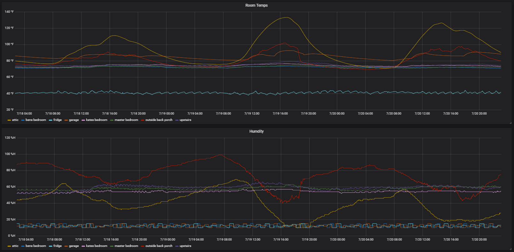

# slurp-rtl_433
slurp-rtl_433 is a simple executable that augments and dumps data from [rtl_433](https://github.com/merbanan/rtl_433) to [InfluxDB](https://www.influxdata.com/time-series-platform/influxdb/) with plans to support [Elasticsearch](https://www.elastic.co/products). It may then be viewed with something like grafana or kibana.



## Installation
slurp-rtl_433 relies upon the rtl_433 process being redirected to a file. The RPM will setup systemd services and such to handle this for you. If you happen to need to run rtl_433 yourself you can view the suggested installation guide that follows the PRM configuration to aid in setup for you.
* Install Using RPM
* [Suggested Manual Installation Guide](##suggested-manual-installation-guide)

## Exectuable Flags
The example configuration file provides information for all the options available. Additionally the config file can be opmitted completely or overwritten with any of the following flags.

|long name|short|description|default|
|---------|------|----------|-------|
|--config|-c|The location of the configuration file.||
|--data-location|-d|The path and file name to the rtl_433 redirected output.|./rtl_433_data.log|
|--meta-data-location|-m|The path to the meta data directory.|./meta/|
|--fqdn|-f|The FQDN of the InfluxDB instance.|localhost|
|--username|-u|The username for the InfluxDB instance.||
|--password|-p|The password for the InfluxDB instance.||
|--database|-b|The name of the InfluxDB database to use.|rtl_433|
|--verbose|-v|Enables verbose level logging.||
|--debug|-D|Enabled debug level logging.||
|--version|-V|Display version information.||


## Suggested Manual Installation Guide
This guide walks through the installation of slurp-rtl_433 to send data to an InfluxDB instance. The configuration matches the configuraton that is provided by the rpm install. You are obviously free to change paths/names/paramerters as needed.

### 1. Setup rtl_433 as a service.
1. Create directory for rtl_433 logs and rtl_433 data.
    ```mkdir -p /var/log/rtl_433/data```
1. Create shell script to start rtl_433 stderr to a log file and stdout in JSON format to the data log file. 
    * You may also wish to limit the devices it listens for using the -R flag.
    * Example: [start_rtl_433.sh](./install/usr/bin/start_rtl_433.sh)
1. Create rtl_433 systemd service file. 
    * Example: [rtl_433.service](./install/etc/systemd/system/rtl_433.service)
1. Create rtl_433 logrotate configuration.
    * Example: [rtl_433](./install/etc/logrotate/rtl_433)
1. Enable the service and start it.
    ```shell
    systemctl enable rtl_433
    systemctl start rtl_433
    ````

### 2. Configure InfluxDB to receive the data.

### 3. Install slurp-rtl_433
1. Place binarary file on the system and in the path.
    * Suggested location: /usr/bin/
2. Create systemd service file.
    * Example: [slurp-rtl_433.service](./install/etc/systemd/system/slurp-rtl_433.service)
3. Create logrotate configuration file.
    * Example: [slurp-rtl_433](./install/etc/logrotate/slurp-rtl_433)
4. Edit the config file as needed.
    * Place config wherever you specify in the systemd service file. e.g. /etc/slurp-rtl_433/config.toml
5. Start the service.
    ```shell
    systemctl enable slurp-rtl_433
    systemctl start slurp-rtl_433
    ```

### 3. Conifgure grafana to view data.

## Important Files and Locations
The follow are important file locations regarding the suggested installation guide and the PRM install. None are required but all are used by the suggested installation guide.

|daemon|location|description|
|------|--------|-----------|
|slurp-rtl_433|/usr/bin/slurp-rtl_433|The slurp-rtl_433 binary.|
|slurp-rtl_433|/etc/default/slurp-rtl_433|The options file for the systemd service.|
|slurp-rtl_433|/etc/slurp-rtl_433/config.toml|The configuration file for slupr-rtl_433.|
|slurp-rtl_433|/var/log/slurp-rtl_433/slurp-rtl_433.log|The log file locatin for slurp_rtl_433.|
|slurp-rtl_433|/var/lib/slurp-rtl_433/meta/|Holds the meta data needed for tracking files roated with logrotate.|
|slurp-rtl_433|/etc/systemd/system/slurp-rtl_433.service|systemd service file for slurp-rtl_433|
|slurp-rtl_433|/etc/logrotate/slurp-rtl_433|logrotate file for slurp-rtl_433|
|rtl_433|/usr/local/bin/rtl_433|The default install location for rtl_433.|
|rtl_433|/usr/bin/start_rtl_433.sh|The script to start rtl_433 and redirect stdout and stderr to the proper locations.|
|rtl_433|/usr/default/rtl_433|The options file for the startup script.|
|rtl_433|/var/log/rtl_433/data/rtl_433_data.log|The data log file from the redirected output.|
|rtl_433|/var/log/rtl_433/rtl_433.log|The output from rtl_433 stderr.|
|rtl_433|/etc/systemd/system/rtl_433.service|systemd service file for rtl_433.|
|rtl_433|/etc/logrotate/slurp-rtl_433|logrotate file for both rtl_433 logs.|

# Supported Devices
The following devices have definitions in slurp-rtl_433.

|Brand|Model|Notes|
|-----|-----|-----|
|AcuRite|Rain Gauge||
|AcuRite|609TXC Sensor||
|AcuRite|Lightning 6045M||
|AcuRite|Tower Sensor||
|AcuRite|5n1 Sensor|Only supports the ACURITE_MSGTYPE_5N1_WINDSPEED_WINDDIR_RAINFALL. <sup>[1](#footnote1)</sup>|
|AcuRite|986 Sensor|
|AcuRite|606 Sensor|
|AcuRite|00275rm|Not supported yet. <sup>[2](#footnote2)</sup>
||||
|Akhan|100F14||
||||
|Ambient Weather|F007TH Thermo-Hygrometer||
||||
|Blyss|dc5-uk-wh|Not supported as appears to not be a universal config.|
||||
|Brennenstuhl|RCS 2044| Not supported. Waiting for elasticsearch support.|
||||
|Bresser|3CH Sensor||
||||
|Calibeur|RF-104||
||||
|Cardin|S466|Not supported. Waiting for elasticsaerch support.|
||||
|Chuango|Security Technology?|Not supported. Waiting for elasticsearch support.|
||||
|CurrentCost|TX?||
||||
|Danfoss|CFR Thermostat||
||||
|Dish|Remote 6.3|Not supported. Waiting for elasticsearch support.|
|DSC|Contact?|Not supported. Waiting for elasticsearch support.|
||||
|Efergy|E2 Classic||
|Efergy|Optical||
||||
|Elro|DB286A|Not supported. Waiting for elasticserach support.|
||||
|ELV| WS 2000|Not supported. Does not appear to support JSON output from rtl_433.|
||||
|Fine Offset|WH24||

# Footnotes
|note|Info|
|----|----|
|<a name="footnote1">1</a>|rtl_433 does not differentiate the output when it is sent. It's possible to process and determine the format being received but it's also possible to simply modify rtl_433 to include a field to denote the type. In either case if you happen to have this sensor and want the values let me know. Currently not spending any time on it unless there is a need.
|<a name="footnote2">2</a>|Without sample output I am not sure what json is provided so I can't parse it yet. If you happen to have one of these and can provide sample output with the -F flag it can be added easily enough.
